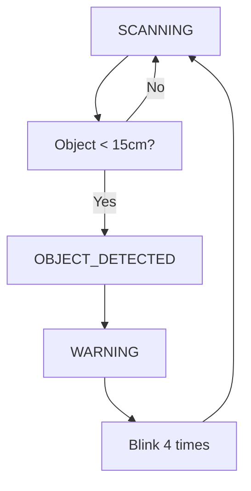

# 🛡️ STM32F411RE Radar Guard System


## 📋 Project Overview

The **STM32F411RE Radar Guard System** is an advanced object detection and monitoring system built using the STM32F411RE Nucleo board. The system combines an ultrasonic sensor with servo motor scanning to create a 180° radar-like surveillance system with real-time visual and audio alerts.

This project demonstrates embedded systems programming, sensor interfacing, PWM control, I2C communication, and state machine design - making it perfect for learning embedded development or as a security monitoring solution.

### ✨ Key Features

- 🎯 **180° Scanning Range** - Automated servo motor sweeping motion (0° to 180°)
- 📏 **Ultrasonic Distance Measurement** - HC-SR04 sensor with 2-400cm range
- 🖥️ **LCD Display** - Real-time status and measurement display (I2C 16x2)
- 🚨 **Multi-State Alert System** - Visual and audio warnings with smart filtering
- 🔄 **State Machine Architecture** - Robust scanning, warning, and detection modes
- 🛠️ **Hardware Diagnostics** - Built-in sensor testing and validation
- 💻 **UART Debug Output** - Real-time monitoring and diagnostics (115200 baud)
- ⚡ **Low Power Design** - Efficient timing and power management
- 🔧 **Configurable Parameters** - Easy customization of detection ranges and timing

### 🎥 System Operation

The system operates in three main states:

1. **🟢 SCANNING** - Servo sweeps 180°, green LED on, monitoring for objects
2. **🟡 WARNING** - Object detected, flashing red LED and buzzer (4 blinks)
3. **🔴 DETECTED** - Object confirmed, steady red LED, detailed info display
| 🍞 **Breadboard** | Half-size | 1 | Prototyping | 400 tie points |
| 🔋 **Power Supply** | 5V adapter/USB | 1 | System power | Min 1A capacity |

## 🔌 Pin Configuration & Wiring Diagram

### 📍 STM32F411RE Pin Assignments

| Function | STM32 Pin | GPIO | Configuration | Description |
|----------|-----------|------|---------------|-------------|
| **HC-SR04 TRIG** | PC0 | GPIO_Output | Push-Pull, No Pull | Ultrasonic trigger signal |
| **HC-SR04 ECHO** | PC1 | GPIO_Input | No Pull | Echo return signal |
| **Servo PWM** | PA8 | TIM1_CH1 | AF, 50Hz | Servo motor control |
| **Red LED** | PB0 | GPIO_Output | Push-Pull | Object detected indicator |
| **Green LED** | PB1 | GPIO_Output | Push-Pull | Safe area indicator |
| **Buzzer** | PC4 | GPIO_Output | Push-Pull | Audio alert |
| **LCD SDA** | PB9 | I2C1_SDA | Open-Drain + Pull-up | I2C data line |
| **LCD SCL** | PB8 | I2C1_SCL | Open-Drain + Pull-up | I2C clock line |
| **Debug UART TX** | PA2 | USART2_TX | AF | Serial output |
| **Debug UART RX** | PA3 | USART2_RX | AF | Serial input |

### 🔧 Detailed Wiring Instructions

#### HC-SR04 Ultrasonic Sensor
```
HC-SR04        →    STM32F411RE
VCC (5V)       →    5V (CN7-Pin 7)
GND            →    GND (CN7-Pin 8)
TRIG           →    PC0 (CN7-Pin 1)
ECHO           →    PC1 (CN7-Pin 2)
```

#### SG90 Servo Motor
```
Servo          →    STM32F411RE
Red (VCC)      →    5V (CN7-Pin 7)
Brown (GND)    →    GND (CN7-Pin 8)
Orange (PWM)   →    PA8 (CN9-Pin 7)
```

#### 16x2 I2C LCD Display
```
LCD Module     →    STM32F411RE
VCC            →    5V (CN7-Pin 7)
GND            →    GND (CN7-Pin 8)
SDA            →    PB9 (CN5-Pin 4)
SCL            →    PB8 (CN5-Pin 10)
```

#### LED Indicators
```
Red LED        →    STM32F411RE
Anode (+)      →    PB0 (CN10-Pin 31) via 220Ω resistor
Cathode (-)    →    GND

Green LED      →    STM32F411RE
Anode (+)      →    PB1 (CN10-Pin 33) via 220Ω resistor
Cathode (-)    →    GND
```

#### Active Buzzer
```
Buzzer         →    STM32F411RE
Positive       →    PC4 (CN7-Pin 3)
Negative       →    GND (CN7-Pin 8)
```

### 🔗 Connection Diagram

```
                    STM32F411RE Nucleo Board
                   ┌─────────────────────────┐
                   │  CN7         CN9        │
         5V ────────┤7                    7├──────── PA8 (Servo PWM)
        GND ────────┤8                     │        
        PC0 ────────┤1 (TRIG)              │        
        PC1 ────────┤2 (ECHO)              │        
        PC4 ────────┤3 (Buzzer)            │        
                   │                      │        
                   │  CN10        CN5     │        
                   │              10├──────── PB8 (LCD SCL)
                   │31├──────── PB0 (Red LED)      
                   │33├──────── PB1 (Green LED)    
                   │               4├──────── PB9 (LCD SDA)
                   └─────────────────────────┘

HC-SR04 Sensor                   I2C LCD Display
┌──────────────┐                 ┌─────────────┐
│ VCC GND TRIG │                 │VCC GND SDA  │
│  │   │   │   │                 │ │   │   │   │
│  │   │   │   │ ECHO            │ │   │   │   │ SCL
└──┼───┼───┼───┼──────────────── └─┼───┼───┼───┼───
   │   │   │   │                   │   │   │   │
   5V  │   PC0 PC1                 5V  │   PB9 PB8
       │                              │
       GND ─────────────────────────── GND

      SG90 Servo                    Buzzer & LEDs
   ┌─────────────┐                 ┌─────────────┐
   │Red Brown    │                 │   Buzzer    │
   │ │   │       │ Orange          │   (PC4)     │
   └─┼───┼───────┼─────────        │             │
     │   │       │                 │ Red LED     │
     5V  GND     PA8               │ (PB0+220Ω)  │
                                   │             │
                                   │ Green LED   │
                                   │ (PB1+220Ω)  │
                                   └─────────────┘
```

## ⚙️ Technical Specifications

### System Performance
- **Scan Range**: 180° (0° to 180°)
- **Scan Speed**: ~7.2°/second (25ms per 2° step)
- **Detection Range**: 2cm to 400cm
- **Detection Accuracy**: ±3mm
- **Response Time**: <100ms
- **Operating Voltage**: 5V DC
- **Power Consumption**: ~500mA peak

### Timing Parameters
| Parameter | Value | Description |
|-----------|-------|-------------|
| Servo Update | 25ms | Movement interval |
| Distance Reading | 50ms | Measurement frequency |
| Warning Blink | 200ms | Alert flash rate |
| Clear Check | 1000ms | Area verification |
| Proximity Alarm | 15cm | Detection threshold |
| Trigger Threshold | 3 readings | False positive filter |

### Timer Configurations
| Timer | Purpose | Frequency | Prescaler | Period |
|-------|---------|-----------|-----------|---------|
| TIM1 | Servo PWM | 50Hz | 839 | 1999 |
| TIM2 | Ultrasonic Timing | 1MHz | 83 | Max (32-bit) |

## 🚀 Getting Started

### Prerequisites

#### Hardware Requirements
- STM32F411RE Nucleo board
- All components listed in hardware section
- USB cable for programming/power
- Computer with STM32CubeIDE

#### Software Requirements
- **STM32CubeIDE** (latest version)
- **STM32CubeMX** (integrated with IDE)
- **STM32 HAL Library** (F4 package)
- Serial terminal software (optional for debugging)

### 🔧 Installation & Setup

#### 1. Clone the Repository
```bash
git clone https://github.com/cjaryou/stm32-radar-guard-system.git
cd stm32-radar-guard-system
```

#### 2. Hardware Assembly
1. **Mount components** on breadboard following wiring diagram
2. **Double-check connections** - incorrect wiring can damage components
3. **Verify power supply** - ensure 5V supply can handle 1A load
4. **Test connections** with multimeter if available

#### 3. STM32CubeIDE Configuration

**Import Project:**
```
File → Import → General → Existing Projects into Workspace
Browse to project folder → Select project → Finish
```

**Configure Peripherals (.ioc file):**
- **TIM1**: PWM Generation CH1, 50Hz (servo control)
- **TIM2**: Internal Clock, 1MHz precision (ultrasonic timing)
- **I2C1**: 100kHz standard mode (LCD communication)
- **USART2**: 115200 baud (debug output)
- **GPIO**: Configure pins as per pin assignment table

#### 4. Build and Flash
```bash
# In STM32CubeIDE:
Project → Build Project
Run → Debug As → STM32 MCU C/C++ Application
```

### 📦 Required Libraries

The project uses the following libraries (included in project):

1. **liquidcrystal_i2c.h** - I2C LCD control library
2. **STM32 HAL Library** - Hardware abstraction layer
3. **Standard C Libraries** - stdio.h, string.h, stdbool.h

## 💻 System Operation

### State Machine Overview



### 🟢 Scanning Mode (STATE_SCANNING)
- **Green LED**: ON (safe indicator)
- **Red LED**: OFF
- **Buzzer**: OFF
- **LCD**: Shows "Radar Scanning" and current angle/distance
- **Servo**: Continuously sweeps 0° to 180°
- **Action**: Monitors for objects within 15cm range

### 🔴 Object Detected Mode (STATE_OBJECT_DETECTED)
- **Green LED**: OFF
- **Red LED**: ON (steady)
- **Buzzer**: OFF
- **LCD**: Shows "OBJECT DETECTED" with distance and angle
- **Servo**: Continues scanning
- **Duration**: 3 seconds, then transitions to warning

### 🟡 Warning Mode (STATE_WARNING)
- **Green LED**: OFF
- **Red LED**: FLASHING (200ms intervals)
- **Buzzer**: FLASHING (synchronized with LED)
- **LCD**: Shows "WARNING" with last detection info
- **Servo**: Continues scanning
- **Duration**: 4 blinks (~1.6 seconds), then returns to scanning

### 📱 UART Debug Output

Connect a serial terminal (115200 baud) to view real-time system information:

```
=== STM32 Radar Guard System Debug ===
System Clock: 84000000 Hz
TIM2: Running ✓ (Counter: 12845)
Angle: 45°, Distance: 23.45 cm, Valid: YES
Angle: 47°, Distance: 22.15 cm, Valid: YES
*** OBJECT DETECTED AT 15° - 12.3cm ***
```

## 🔧 Customization & Configuration

### 📝 Adjustable Parameters (in bitirme.c)

```c
// Distance and detection settings
#define PROXIMITY_ALARM_DISTANCE    15.0f   // Alarm distance (cm)
#define MIN_DETECTION_DISTANCE      2.0f    // Minimum detection (cm)
#define MAX_DETECTION_DISTANCE      400.0f  // Maximum detection (cm)

// Timing settings
#define SERVO_UPDATE_INTERVAL       25      // Servo movement (ms)
#define DISTANCE_READ_INTERVAL      50      // Distance reading (ms)
#define WARNING_BLINK_INTERVAL      200     // Warning blink (ms)

// Detection filtering
#define TRIGGER_THRESHOLD           3       // Detections for alarm
#define CLEAR_THRESHOLD             5       // Readings for clear

// Servo settings
#define SERVO_STEP                  2       // Degrees per step
```

### 🎛️ Common Customizations

#### Adjust Detection Sensitivity
```c
// For closer detection (security application)
#define PROXIMITY_ALARM_DISTANCE    10.0f

// For wider detection (room monitoring)
#define PROXIMITY_ALARM_DISTANCE    25.0f
```

#### Change Scan Speed
```c
// Faster scanning
#define SERVO_UPDATE_INTERVAL       15      // Faster servo
#define SERVO_STEP                  3       // Bigger steps

// Slower, more precise scanning
#define SERVO_UPDATE_INTERVAL       40      // Slower servo
#define SERVO_STEP                  1       // Smaller steps
```

#### Modify Alert Behavior
```c
// More sensitive triggering
#define TRIGGER_THRESHOLD           1       // Immediate detection

// Less false positives
#define TRIGGER_THRESHOLD           5       // More filtering
```

## 🛠️ Troubleshooting Guide

### ⚠️ Common Issues

#### 1. Sensor Shows Maximum 3.9cm Reading
**Cause**: Timer2 configuration issue
**Solution**:
```
1. Open .ioc file in STM32CubeIDE
2. Configure TIM2: Prescaler=83, Period=4294967295
3. Regenerate code and rebuild
```

#### 2. Servo Not Moving
**Symptoms**: No servo movement, possible jittering
**Solutions**:
- Check 5V power supply (needs 1A+ capacity)
- Verify PA8 connection to servo signal wire
- Ensure TIM1 PWM is enabled in code
- Check servo ground connection

#### 3. LCD Not Displaying
**Symptoms**: Blank screen or garbled text
**Solutions**:
- Verify I2C address (usually 0x27 or 0x3F)
- Check SDA/SCL connections (PB9/PB8)
- Ensure 5V power to LCD module
- Add 4.7kΩ pull-up resistors on SDA/SCL if needed

#### 4. False Detections
**Symptoms**: Random object alerts with no objects present
**Solutions**:
- Increase `TRIGGER_THRESHOLD` value
- Check sensor mounting (avoid vibrations)
- Ensure sensor faces away from walls/obstacles
- Verify stable power supply

#### 5. No UART Debug Output
**Symptoms**: No data in serial terminal
**Solutions**:
- Check baud rate (115200)
- Verify PA2 (TX) connection
- Ensure USB virtual COM port drivers installed
- Try different serial terminal software

### 🔍 Diagnostic Tools

#### Hardware Test Functions
The system includes built-in diagnostic functions:

```c
hardware_diagnostic_check();    // System health check
test_ultrasonic_sensor();      // Sensor functionality test
```

#### Debug Monitoring
Monitor system behavior via UART:
```bash
# Example output analysis
Angle: 90°, Distance: 999.00 cm, Valid: NO    # Sensor issue
Angle: 45°, Distance: 15.23 cm, Valid: YES    # Normal operation
TIM2: Running ✓ (Counter: 45231)              # Timer working
```

## 📊 Performance Optimization

### 🚀 Speed Optimizations

#### 1. Faster Scanning
```c
#define SERVO_UPDATE_INTERVAL       20      // From 25ms to 20ms
#define SERVO_STEP                  3       // From 2° to 3° steps
```

#### 2. Improved Accuracy
```c
#define SENSOR_READINGS_COUNT       5       // More averaging
#define DISTANCE_READ_INTERVAL      30      // More frequent reads
```

#### 3. Power Saving
```c
// Add power management
HAL_PWR_EnterSLEEPMode(PWR_MAINREGULATOR_ON, PWR_SLEEPENTRY_WFI);
```

### 📈 Memory Usage
- **Flash**: ~45KB (including HAL library)
- **RAM**: ~8KB (dynamic variables and buffers)
- **Stack**: ~2KB (function calls and local variables)

## 🧪 Testing & Validation

### 🔬 Test Procedures

#### 1. System Startup Test
```
1. Power on system
2. Verify LCD shows "STM32 Radar Guard"
3. Check servo moves to 0° position
4. Confirm green LED turns on
5. Monitor UART for diagnostic output
```

#### 2. Detection Range Test
```
Test objects at: 5cm, 10cm, 15cm, 20cm, 30cm
Expected: Alerts for objects ≤15cm only
```

#### 3. Scanning Accuracy Test
```
Place object at known angle (e.g., 90°)
Verify system reports correct angle ±5°
```

#### 4. State Transition Test
```
1. Place object in range → STATE_OBJECT_DETECTED
2. Wait 3 seconds → STATE_WARNING
3. Wait for 4 blinks → STATE_SCANNING
```

### 📋 Test Results Log

| Test | Expected | Result | Status |
|------|----------|---------|---------|
| Power On | Green LED + LCD | ✅ | PASS |
| Servo Range | 0° to 180° | ✅ | PASS |
| Detection 10cm | Alert triggered | ✅ | PASS |
| Detection 20cm | No alert | ✅ | PASS |
| State Machine | Correct transitions | ✅ | PASS |

## 🚀 Advanced Features & Extensions

### 🌟 Possible Enhancements

#### 1. Wireless Communication
```c
// Add ESP8266/ESP32 module for WiFi alerts
// Send detection data to smartphone app
```

#### 2. Data Logging
```c
// Add SD card module for detection history
// Store timestamp, angle, distance data
```

#### 3. Multiple Sensor Array
```c
// Use multiple HC-SR04 sensors
// Create 360° coverage system
```

#### 4. Computer Vision Integration
```c
// Add camera module
// Implement object recognition
```

#### 5. IoT Integration
```c
// MQTT publishing for home automation
// Integration with smart home systems
```

## 📚 Code Architecture

### 🏗️ Project Structure

```
stm32-radar-guard/
├── Core/
│   ├── Src/
│   │   ├── main.c              # Main application (bitirme.c)
│   │   ├── stm32f4xx_it.c      # Interrupt handlers
│   │   └── stm32f4xx_hal_msp.c # HAL MSP functions
│   └── Inc/
│       ├── main.h              # Main header
│       └── stm32f4xx_it.h      # Interrupt headers
├── Drivers/                    # STM32 HAL drivers
├── liquidcrystal_i2c/          # LCD library
└── README.md                   # This documentation
```

### 🔧 Key Functions

| Function | Purpose | Parameters |
|----------|---------|------------|
| `servo_set_angle()` | Control servo position | angle (0-180°) |
| `ultrasonic_read_distance()` | Measure distance | none → float (cm) |
| `state_change_to_*()` | State transitions | none |
| `system_update_*()` | State processing | none |
| `hardware_diagnostic_check()` | System testing | none |

## 🤝 Contributing

### 💡 How to Contribute

1. **Fork** the repository
2. **Create** feature branch (`git checkout -b feature/new-feature`)
3. **Commit** changes (`git commit -am 'Add new feature'`)
4. **Push** to branch (`git push origin feature/new-feature`)
5. **Create** Pull Request

### 🐛 Bug Reports

Please include:
- STM32CubeIDE version
- Hardware configuration
- Steps to reproduce
- Expected vs actual behavior
- Serial output logs

### 💭 Feature Requests

We welcome suggestions for:
- New sensor integrations
- Enhanced algorithms
- Performance improvements
- Documentation updates

## 📄 License

This project is licensed under the **MIT License** - see the [LICENSE](LICENSE) file for details.

### 📜 License Summary
- ✅ Commercial use allowed
- ✅ Modification allowed
- ✅ Distribution allowed
- ✅ Private use allowed
- ❌ No warranty provided
- ❌ No liability assumed

## 👨‍💻 Author & Acknowledgments

### 🔹 Author
**Numan Haktan Kartal** - *Initial work and development*
- 📧 Email: cjaryou5@gmail.com
- 🐙 GitHub: [@cjaryou](https://github.com/cjaryou)
- 💼 LinkedIn: [Haktan Kartal](https://www.linkedin.com/in/haktan-kartal-a8207b36b/)

### 🙏 Acknowledgments

- **STMicroelectronics** for STM32 HAL library and documentation
- **Open source community** for I2C LCD libraries
- **Arduino community** for HC-SR04 reference implementations
- **Contributors** who helped improve this project

## 🏆 Project Status

**Status**: ✅ **Stable Release v1.0**

- ✅ Core functionality complete
- ✅ Hardware tested and verified
- ✅ Documentation complete
- ✅ Ready for production use

### 📈 Statistics


---

### 🎯 **Ready to build your own radar guard system? Follow the setup guide above and happy coding!** 🚀

**⭐ If this project helped you, please give it a star! ⭐**
## 🔧 Hardware Components

| Component | Model/Type | Quantity | Purpose | Notes |
|-----------|------------|----------|---------|-------|
| 🎛️ **Microcontroller** | STM32F411RE Nucleo | 1 | Main control unit | 84MHz ARM Cortex-M4 |
| 📡 **Ultrasonic Sensor** | HC-SR04 | 1 | Distance measurement | 2-400cm range, ±3mm accuracy |
| 🔄 **Servo Motor** | SG90 (or similar) | 1 | 180° scanning motion | 50Hz PWM control |
| 🖥️ **LCD Display** | 16x2 I2C LCD (PCF8574) | 1 | Status display | 0x27 default address |
| 🔴 **Red LED** | 5mm LED | 1 | Object detection indicator | Forward voltage ~2V |
| 🟢 **Green LED** | 5mm LED | 1 | Safe area indicator | Forward voltage ~2.2V |
| 🔊 **Buzzer** | Active buzzer | 1 | Audio alerts | 3-5V operation |
| ⚡ **Resistors** | 220Ω | 2 | LED current limiting | 1/4W carbon film |
| 🔌 **Jumper Wires** | Male-to-Male/Female | ~20 | Connections | Quality dupont wires |
| 🍞 **Breadboard** | Half-size | 1 | Prototyping | 400 tie points |
| 🔋 **Power Supply** | 5V adapter/USB | 1 | System power | Min 1A capacity |

## 📐 Pin Configuration & Connections

### 🎯 STM32F411RE Pin Assignments

```
┌─────────────────────────────────────────┐
│            STM32F411RE NUCLEO           │
├─────────────────────────────────────────┤
│                                         │
│  PC0  ──────► HC-SR04 TRIG (Output)    │
│  PC1  ──────► HC-SR04 ECHO (Input)     │
│  PC4  ──────► Buzzer (Output)          │
│  PB0  ──────► Red LED (Output)         │
│  PB1  ──────► Green LED (Output)       │
│  PA8  ──────► Servo PWM (TIM1_CH1)     │
│  PB8  ──────► LCD SDA (I2C1)           │
│  PB9  ──────► LCD SCL (I2C1)           │
│  PA2  ──────► UART TX (Debug)          │
│  PA3  ──────► UART RX (Debug)          │
│                                         │
└─────────────────────────────────────────┘
```

### 🔌 Detailed Wiring Diagram

#### HC-SR04 Ultrasonic Sensor
```
HC-SR04          STM32F411RE
┌─────────┐      ┌──────────┐
│   VCC   │ ──── │   5V     │
│   TRIG  │ ──── │   PC0    │
│   ECHO  │ ──── │   PC1    │
│   GND   │ ──── │   GND    │
└─────────┘      └──────────┘
```

#### SG90 Servo Motor
```
SG90 Servo       STM32F411RE
┌─────────┐      ┌──────────┐
│  Red    │ ──── │   5V     │
│  Brown  │ ──── │   GND    │
│  Orange │ ──── │   PA8    │ (TIM1_CH1 - PWM)
└─────────┘      └──────────┘
```

#### 16x2 I2C LCD Display
```
I2C LCD          STM32F411RE
┌─────────┐      ┌──────────┐
│   VCC   │ ──── │   5V     │
│   GND   │ ──── │   GND    │
│   SDA   │ ──── │   PB9    │ (I2C1_SDA)
│   SCL   │ ──── │   PB8    │ (I2C1_SCL)
└─────────┘      └──────────┘
```

#### LED Indicators & Buzzer
```
Components       STM32F411RE      
┌─────────┐      ┌──────────┐
│Red LED+ │ ──── │   PB0    │ ─── 220Ω ─── │Red LED-│ ─── GND
│Green +  │ ──── │   PB1    │ ─── 220Ω ─── │Green - │ ─── GND  
│Buzzer+  │ ──── │   PC4    │
│Buzzer-  │ ──── │   GND    │
└─────────┘      └──────────┘
```

## ⚙️ System Configuration

### 🔄 Timer Configuration
- **TIM1**: PWM generation for servo motor (50Hz, 20ms period)
  - Prescaler: 839
  - Period: 1999
  - PWM Range: 1-2ms (0°-180°)

- **TIM2**: Microsecond counter for ultrasonic sensor
  - Prescaler: 83 (1MHz frequency)
  - Period: 4294967295 (maximum)

### 📡 I2C Configuration
- **I2C1**: LCD communication
  - Clock Speed: 100kHz
  - 7-bit addressing mode

### 💻 UART Configuration
- **USART2**: Debug output and monitoring
  - Baud Rate: 115200
  - 8-bit data, 1 stop bit, no parity

## 🚀 System Operation

### 📊 State Machine Diagram

```
    ┌─────────────┐
    │  SCANNING   │ ◄──┐
    │   (Green)   │    │
    └──────┬──────┘    │
           │            │
      Object Detected   │
         (< 15cm)       │
           │            │
           ▼            │
    ┌─────────────┐     │
    │   OBJECT    │     │
    │  DETECTED   │     │ 3 seconds
    │   (Red)     │     │
    └──────┬──────┘     │
           │            │
        3 seconds       │
           │            │
           ▼            │
    ┌─────────────┐     │
    │   WARNING   │     │
    │ (Blinking)  │ ────┘
    └─────────────┘
        4 blinks
```

### 🎯 Operating Modes

#### 1. 🔍 **SCANNING Mode** (Normal Operation)
- **Status**: Green LED ON, Buzzer OFF
- **LCD Display**: "Radar Scanning" / "Area Safe"
- **Action**: Servo sweeps 0°-180°, distance measurements every 5°
- **Trigger**: Object detected within 15cm for 3 consecutive readings

#### 2. 🚨 **OBJECT DETECTED Mode**
- **Status**: Red LED ON (steady), Buzzer OFF
- **LCD Display**: "OBJECT DETECTED" / Distance and angle info
- **Duration**: 3 seconds
- **Next State**: Automatically transitions to WARNING mode

#### 3. ⚠️ **WARNING Mode**
- **Status**: Red LED BLINKING, Buzzer BLINKING (synchronized)
- **LCD Display**: "*** WARNING ***" / Distance information
- **Duration**: 4 blinks (approximately 1.6 seconds)
- **Next State**: Returns to SCANNING mode

## 📏 Technical Specifications

### 🎯 Detection Parameters
```c
#define PROXIMITY_ALARM_DISTANCE    15.0f   // Alert threshold (cm)
#define MIN_DETECTION_DISTANCE      2.0f    // Minimum detectable range
#define MAX_DETECTION_DISTANCE      400.0f  // Maximum detectable range
#define TRIGGER_THRESHOLD           3       // Consecutive detections for alarm
```

### ⏱️ Timing Configuration
```c
#define SERVO_UPDATE_INTERVAL       25      // Servo movement (ms)
#define DISTANCE_READ_INTERVAL      50      // Distance measurement (ms)
#define WARNING_BLINK_INTERVAL      200     // Warning blink rate (ms)
#define SERVO_STEP                  2       // Degrees per servo step
```

### 📐 Performance Metrics
- **Scanning Range**: 180° (0° to 180°)
- **Angular Resolution**: 2° steps (90 measurement points)
- **Distance Accuracy**: ±1cm (typical)
- **Scan Rate**: ~7.5 seconds per complete 180° sweep
- **Response Time**: <150ms from detection to alert

## 🛠️ Building and Setup

### 📋 Prerequisites
- **STM32CubeIDE** or **Keil µVision**
- **STM32CubeMX** for configuration
- **STM32 HAL Libraries**
- **liquidcrystal_i2c library** for LCD control

### 🔧 Compilation Steps

1. **Clone the repository**:
```bash
git clone https://github.com/yourusername/stm32-radar-guard-system.git
cd stm32-radar-guard-system
```

2. **Open project in STM32CubeIDE**:
   - Import existing project
   - Select the project folder

3. **Build the project**:
   - Right-click project → Build Project
   - Or use Ctrl+B

4. **Flash to STM32F411RE**:
   - Connect Nucleo board via USB
   - Right-click project → Run As → STM32 C/C++ Application

### 📚 Required Libraries

Add these includes to your project:
```c
#include "main.h"
#include "liquidcrystal_i2c.h"
#include <stdio.h>
#include <string.h>
#include <stdbool.h>
#include <stdarg.h>
```

## 🔍 Debugging and Diagnostics

### 💻 UART Debug Output
The system provides comprehensive debug information via UART:

```
=== HARDWARE DIAGNOSTIC CHECK ===
System Clock: 84000000 Hz
TIM2: Running ✓ (Counter: 12845)
PC0 (TRIG) Mode: Output ✓
PC1 (ECHO) Mode: Input ✓
ECHO state changes detected: 156
=== DIAGNOSTIC COMPLETED ===

Angle: 0°, Distance: 25.43 cm, Attempts: 1, Valid: YES
Angle: 5°, Distance: 28.12 cm, Attempts: 1, Valid: YES
Angle: 10°, Distance: 30.87 cm, Attempts: 1, Valid: YES
```

### 🧪 Built-in Test Functions
- **Hardware Diagnostic Check**: Validates timer, GPIO, and system configuration
- **Ultrasonic Sensor Test**: 10-measurement validation with statistics
- **Real-time Monitoring**: Continuous angle, distance, and system state reporting

## ⚡ Power Requirements

| Component | Voltage | Current | Notes |
|-----------|---------|---------|-------|
| STM32F411RE | 3.3V | ~50mA | USB powered |
| HC-SR04 | 5V | ~15mA | Peak during measurement |
| SG90 Servo | 5V | ~100-200mA | Peak during movement |
| I2C LCD | 5V | ~20mA | With backlight |
| LEDs + Buzzer | 3.3V | ~30mA | Combined |
| **Total** | **5V** | **~300mA** | **USB sufficient** |

## 🔧 Customization Options

### 📏 Distance Sensitivity
```c
// Adjust detection range
#define PROXIMITY_ALARM_DISTANCE    20.0f   // Increase for earlier detection
#define TRIGGER_THRESHOLD           5       // More filtering for stability
```

### ⏱️ Scan Speed
```c
// Faster scanning
#define SERVO_UPDATE_INTERVAL       15      // Faster servo movement
#define SERVO_STEP                  3       // Larger angle steps
```

### 🎵 Alert Behavior
```c
// Custom warning pattern
#define WARNING_BLINK_INTERVAL      100     // Faster blinking
```

## 🐛 Troubleshooting

### ❌ Common Issues

| Problem | Possible Cause | Solution |
|---------|----------------|----------|
| 🚫 No distance readings | HC-SR04 wiring | Check VCC=5V, GND, TRIG=PC0, ECHO=PC1 |
| 🔄 Servo not moving | PWM configuration | Verify TIM1 settings, PA8 connection |
| 📺 LCD blank | I2C address/wiring | Check SDA=PB9, SCL=PB8, try I2C scan |
| 🔇 No debug output | UART configuration | Check baud rate (115200), PA2/PA3 |
| ⚡ System resets | Power supply | Ensure adequate 5V supply for servo |

### 🔍 Debug Commands
Monitor system via UART terminal (115200 baud):
```
=== ENHANCED ULTRASONIC SENSOR TEST ===
Test 1: Timer functionality
Test 2: GPIO functionality  
Test 3: Distance measurements
Valid readings: 8/10 (80.0%)
Range: 12.45 cm to 45.67 cm, Average: 28.34 cm
```

## 📈 Future Enhancements

- 🌐 **WiFi Connectivity**: ESP32 integration for remote monitoring
- 📱 **Mobile App**: Real-time radar display and alerts
- 💾 **Data Logging**: SD card storage for detection history
- 🎯 **Multi-zone Detection**: Configurable detection zones
- 🔊 **Voice Alerts**: Audio announcements for detected objects
- 📊 **Web Dashboard**: Browser-based monitoring interface
