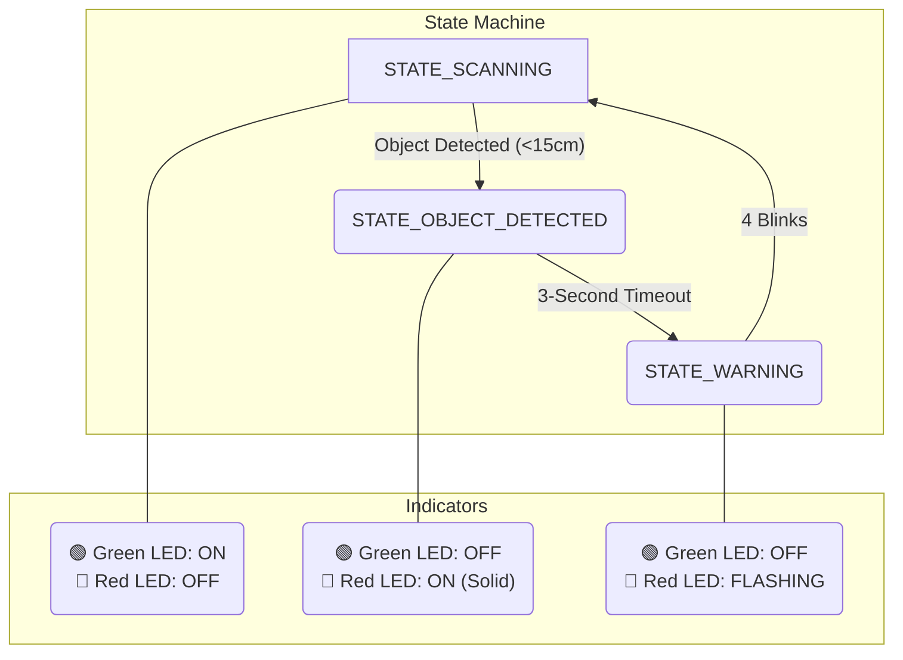

# 🛡️ STM32F411RE Radar Guard System

## 📋 Project Overview

The **STM32F411RE Radar Guard System** is an advanced object detection and monitoring solution built on the STM32F411RE Nucleo-64 board. By integrating an HC-SR04 ultrasonic sensor with a servo motor, the system creates a 180° radar-like field of view. It provides real-time alerts through an LCD, LEDs, and a buzzer, making it an excellent project for learning embedded systems or for use as a practical security device.

This project demonstrates core embedded development concepts, including sensor interfacing, PWM servo control, I2C communication for displays, and robust state machine design.

### ✨ Key Features

- **180° Scanning Range**: An SG90 servo motor provides a wide, automated sweep from 0° to 180°
- **Ultrasonic Distance Measurement**: The HC-SR04 sensor accurately measures distances from 2cm to 400cm
- **Real-Time Feedback**: A 16x2 I2C LCD displays system status, angle, and distance measurements
- **Multi-State Alert System**: A smart state machine manages scanning, warning, and detected modes with visual (LEDs) and audio (buzzer) alerts
- **Robust & Efficient**: Built with a state machine architecture, hardware diagnostics, and efficient power management
- **Debug Ready**: UART output (115200 baud) provides real-time diagnostic information
- **Highly Configurable**: Key parameters like detection distance, scan speed, and alert timing are easily adjustable

## 🔧 Hardware Components

| Component | Model/Type | Qty | Purpose | Notes |
|-----------|------------|-----|---------|-------|
| 🎛️ **Microcontroller** | STM32F411RE Nucleo-64 | 1 | Main control unit | 84MHz ARM Cortex-M4 |
| 📡 **Ultrasonic Sensor** | HC-SR04 | 1 | Distance measurement | 2-400cm range, ±3mm accuracy |
| 🔄 **Servo Motor** | SG90 (or similar) | 1 | 180° scanning motion | 50Hz PWM control |
| 🖥️ **LCD Display** | 16x2 I2C LCD (PCF8574) | 1 | Status & data display | Default I2C Address: 0x27 |
| 🔴 **Red LED** | 5mm LED | 1 | Detection indicator | ~2V forward voltage |
| 🟢 **Green LED** | 5mm LED | 1 | System safe indicator | ~2.2V forward voltage |
| 🔊 **Buzzer** | Active Buzzer | 1 | Audible alerts | 3-5V operation |
| ⚡ **Resistors** | 220Ω | 2 | LED current limiting | 1/4W |
| 🔌 **Jumper Wires** | M/M, M/F | ~20 | Component connections | DuPont style |
| 🍞 **Breadboard** | Half-size | 1 | Prototyping circuit | |
| 🔋 **Power Supply** | 5V Adapter or USB | 1 | System power | Minimum 1A recommended |

## 🔌 Pin Configuration & Wiring

### 📍 STM32F411RE Pin Assignments

| Function | STM32 Pin | GPIO | Configuration | Description |
|----------|-----------|------|---------------|-------------|
| **HC-SR04 TRIG** | `PC0` | GPIO_Output | Push-Pull, No Pull | Ultrasonic sensor trigger signal |
| **HC-SR04 ECHO** | `PC1` | GPIO_Input | No Pull | Ultrasonic sensor echo signal |
| **Servo PWM** | `PA8` | `TIM1_CH1` | Alternate Function | Servo motor control (50Hz) |
| **Red LED** | `PB0` | GPIO_Output | Push-Pull | "Object Detected" indicator |
| **Green LED** | `PB1` | GPIO_Output | Push-Pull | "Scanning/Safe" indicator |
| **Buzzer** | `PC4` | GPIO_Output | Push-Pull | Audible alert signal |
| **LCD SDA** | `PB9` | `I2C1_SDA` | Open-Drain + Pull-up | I2C data line for LCD |
| **LCD SCL** | `PB8` | `I2C1_SCL` | Open-Drain + Pull-up | I2C clock line for LCD |
| **Debug UART TX** | `PA2` | `USART2_TX` | Alternate Function | Serial data output for debugging |
| **Debug UART RX** | `PA3` | `USART2_RX` | Alternate Function | Serial data input (optional) |

### 🔧 Wiring Diagram

```
            STM32F411RE Nucleo-64
          ┌─────────────────────────┐
          │      CN7      CN9       │
  5V ─────┤ 5V            PWM (PA8) ├───── Orange (Servo)
 GND ─────┤ GND                     │
 TRIG ────┤ PC0                     │
 ECHO ────┤ PC1                     │
 BUZZER ──┤ PC4                     │
          │                         │
          │      CN10     CN5       │
 RED LED ─┤ PB0           SCL (PB8) ├───── SCL (LCD)
 GRN LED ─┤ PB1           SDA (PB9) ├───── SDA (LCD)
          └─────────────────────────┘

┌───────────────┐      ┌─────────────┐      ┌──────────────────┐
│ HC-SR04       │      │ SG90 Servo  │      │ I2C LCD          │
├───────────────┤      ├─────────────┤      ├──────────────────┤
│ VCC → 5V      │      │ Red → 5V    │      │ VCC → 5V         │
│ GND → GND     │      │ Brown → GND │      │ GND → GND        │
│ TRIG → PC0    │      │ Orange → PA8│      │ SDA → PB9        │
│ ECHO → PC1    │      └─────────────┘      │ SCL → PB8        │
└───────────────┘                           └──────────────────┘

┌───────────────────────────────┐
│ LEDs & Buzzer                 │
├───────────────────────────────┤
│ Red LED (+) → 220Ω → PB0      │
│ Green LED (+) → 220Ω → PB1    │
│ Buzzer (+) → PC4              │
│ All (-) → GND                 │
└───────────────────────────────┘
```

## ⚙️ System Operation & Technical Details

### State Machine Diagram

The system's logic is governed by a simple yet robust state machine:



1. **🟢 STATE_SCANNING**: The default state. The servo sweeps 180°, the green LED is on, and the system actively scans for objects within the `PROXIMITY_ALARM_DISTANCE`.
2. **🔴 STATE_OBJECT_DETECTED**: Triggered when an object is consistently detected. The servo continues to scan, the red LED turns on (solid), and the LCD displays the object's angle and distance. This state lasts for 3 seconds before escalating.
3. **🟡 STATE_WARNING**: After the detection period, the system enters a warning state. The red LED and buzzer pulse in sync for 4 cycles to alert the user before returning to the scanning state.

### 📊 Technical Specifications

| Parameter | Value | Description |
|-----------|-------|-------------|
| **Scan Range** | 0° to 180° | Full semi-circle coverage |
| **Angular Resolution** | 2° per step | Adjustable via `SERVO_STEP` |
| **Detection Range** | 2cm – 400cm | Effective range of the HC-SR04 |
| **Proximity Alarm** | 15cm | Default distance to trigger an alert |
| **Response Time** | < 150ms | Time from detection to state change |
| **Operating Voltage** | 5V DC | Provided via USB or external supply |
| **Peak Power** | ~300-500mA | Primarily due to servo motor movement |

### ⏱️ Timer Configurations

- **TIM1 (Servo PWM)**: Configured for 50Hz (20ms period) to drive the SG90 servo
  - *Prescaler*: 839
  - *Counter Period*: 1999
- **TIM2 (Ultrasonic Timing)**: Configured as a high-resolution 1MHz timer to accurately measure the echo pulse duration
  - *Prescaler*: 83
  - *Counter Period*: `0xFFFFFFFF` (Max 32-bit value)

## 🚀 Getting Started

### Prerequisites

- **Hardware**: All components listed in the hardware table
- **Software**: [**STM32CubeIDE**](https://www.st.com/en/development-tools/stm32cubeide.html) (latest version)
- **Libraries**:
  - STM32Cube HAL for F4 series
  - `liquidcrystal_i2c.h` (typically included in the project)

### 🔧 Installation and Setup

1. **Clone the Repository**:

   ```bash
   git clone https://github.com/cjaryou/stm32-radar-guard-system.git
   cd stm32-radar-guard-system
   ```

2. **Assemble the Hardware**:

   - Carefully connect all components on a breadboard according to the wiring diagram
   - Pay close attention to power (5V) and ground (GND) connections

3. **Open in STM32CubeIDE**:

   - Go to `File > Import...`
   - Select `General > Existing Projects into Workspace`
   - Browse to and select the cloned repository folder. Click `Finish`

4. **Verify Configuration (`.ioc` file)**:

   - Double-click the `.ioc` file to open the STM32CubeMX perspective
   - Confirm that the pin configurations for `TIM1`, `I2C1`, `USART2`, and all GPIOs match the pin assignment table

5. **Build and Flash**:

   - Build the project using `Project > Build Project` (or `Ctrl+B`)
   - Flash the code to the Nucleo board by selecting `Run > Run` (or `F11`)

## 🔧 Customization & Configuration

Parameters can be easily modified in `Core/Src/main.c` to tune system behavior:

```c
// in main.c

// --- Detection & Sensitivity ---
#define PROXIMITY_ALARM_DISTANCE   15.0f  // (cm) How close an object must be to trigger an alarm
#define TRIGGER_THRESHOLD          3      // Number of consecutive readings needed to confirm detection
#define CLEAR_THRESHOLD            5      // Number of consecutive "clear" readings to reset state

// --- Timing & Speed ---
#define SERVO_UPDATE_INTERVAL      25     // (ms) Delay between servo movements. Lower is faster
#define SERVO_STEP                 2      // (degrees) Angle increment for each servo step. Higher is faster
#define DISTANCE_READ_INTERVAL     50     // (ms) How often to poll the ultrasonic sensor
#define WARNING_BLINK_INTERVAL     200    // (ms) The on/off duration for the warning LED/buzzer
```

## 🛠️ Troubleshooting Guide

| Issue | Possible Cause | Solution |
|-------|----------------|----------|
| **Servo Not Moving or Jittering** | Insufficient power; incorrect PWM signal | Ensure your 5V supply can provide >1A. Verify `PA8` is connected to the servo signal wire. Check `TIM1` configuration. |
| **LCD is Blank or Garbled** | Incorrect I2C address; faulty wiring | The default address is `0x27`. Check `PB8` (SCL) and `PB9` (SDA) connections. Ensure the LCD has 5V power. |
| **Sensor stuck at max/min reading** | `TIM2` configuration issue or wiring fault | In the `.ioc` file, set `TIM2` prescaler to 83. Check TRIG (`PC0`) and ECHO (`PC1`) connections. |
| **False Detections** | Environmental noise; electrical interference | Increase the `TRIGGER_THRESHOLD` value. Ensure the sensor has a clear line of sight and a stable power source. |
| **No UART Debug Output** | Incorrect serial settings or wiring | Set your terminal to **115200 baud**. Verify the Nucleo's virtual COM port is selected and `PA2` is correctly configured. |

## 🚀 Future Enhancements

- **Wireless Communication**: Integrate an ESP8266 or ESP32 to send alerts over WiFi to a mobile app or web dashboard
- **Data Logging**: Add an SD card module to log detection events with timestamps for historical analysis
- **Multi-Sensor Array**: Combine multiple ultrasonic sensors for 360° coverage or to eliminate blind spots
- **IoT Integration**: Publish detection data to an MQTT broker for integration with smart home platforms like Home Assistant

## 🤝 Contributing

Contributions are welcome! Please fork the repository, create a new feature branch, and submit a pull request with your improvements. For bug reports, please provide detailed steps to reproduce the issue.

## 📄 License

This project is licensed under the **MIT License**. See the `LICENSE` file for full details.

## 👨‍💻 Author & Acknowledgments

- **Author**: Numan Haktan Kartal ([@cjaryou](https://github.com/cjaryou))
- **Acknowledgments**: This project builds on the great work of the STMicroelectronics team (HAL library), the Arduino community (sensor logic), and open-source contributors.

---

**⭐ If this project was helpful, please give it a star on GitHub! ⭐**
